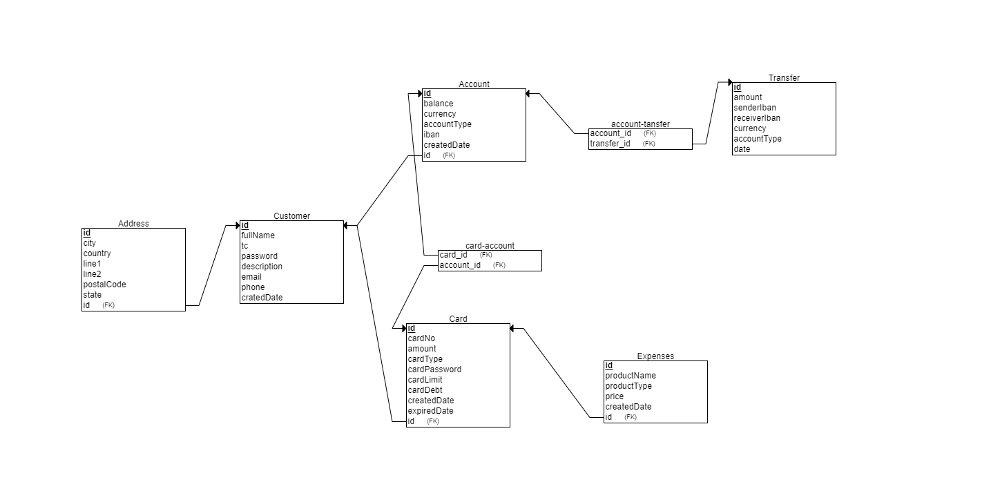
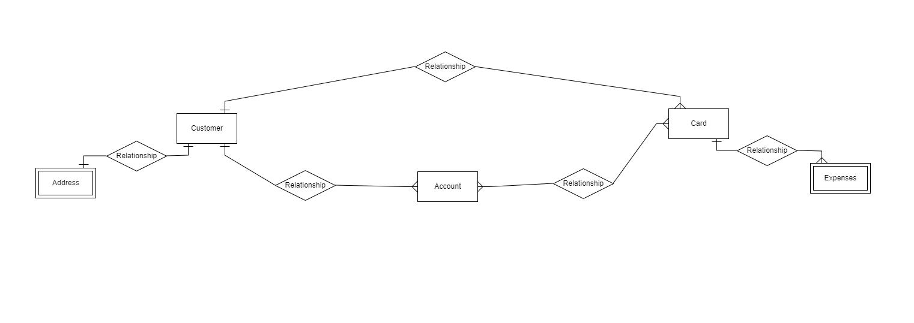
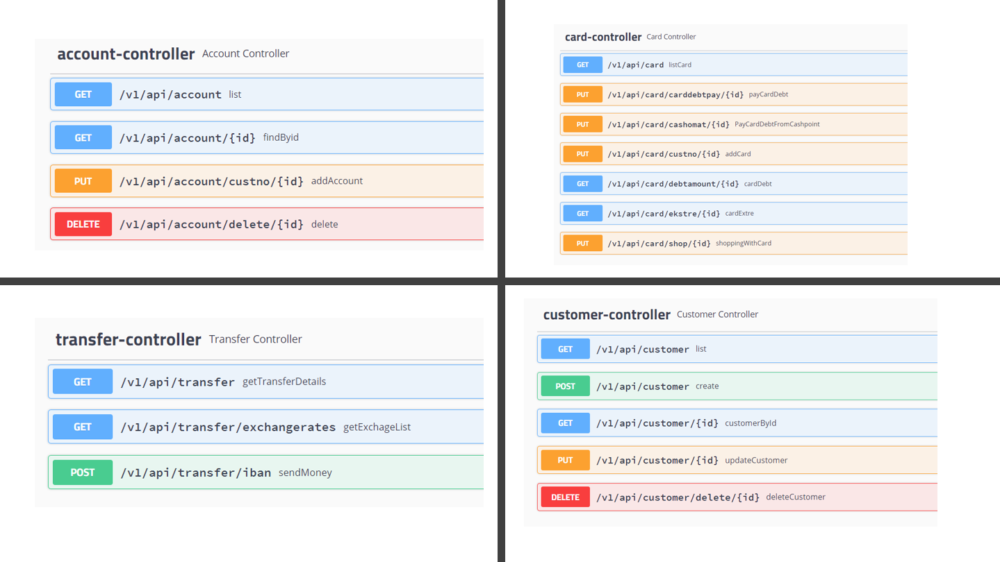

# Online Banka Sistemi

## Fonksiyonlar
* Müşteri yönetimi
* Hesap yönetimi
* Kart yönetimi
* Transfer yönetimi

### Müşteri yönetimi
Yaratılacak API'lar aracılığıyla; müşteri yaratma, güncelleme ve silme işlemleri mümkün olacaktır. Silme işlemi hesaplarında
parası bulunan yada kredi kartı borcu bulunan müşteriler için mümkün olmayacak.

### Eklenenler
* Müşteri oluşturma
* Müşteri güncelleme
* Müşteri silme
* İstanen koşullar sağlandı(Borç ve hesap)

### Hesap yönetimi
Banka müşterilerinin yatırımlarını kontrol etmek amacıyla kullanabilmeleri için hesap yaratmalarına, silmelerine API'lar
aracılığıyla izin verilecektir. Kullanıcılar iki farkılı türde hesap açabilecek, vadesiz mevduat hesabı ve birikim hesabı.
İki hesap arası para transferi yapılabilecek, vadesiz mevduat hesabı başka hesaplara para transferi için kullanılabilecekken
birikim hesabından doğrudan para transferi yapılamayacak. Hesaplar TL, Euro yada Dolar para birimlerinde açılabilecek.

### Eklenenler
* Hesap oluşturma
* Hesap silme
* İstenen koşullar sağlandı

### Kart yönetimi
Müşterilere banka tarafından bankamatiklerde yada alışverişte kullanılmak üzere ön ödemeli banka kartı ve kredi kartları
sunulmaktadır. Bu kartların yaratılması, müşteri ve hesapla ilişkilendirilmesi, kart kullanarak para transferi (alışveriş) 
fonksiyonları API'lar aracılığıyla sağlanacaktır.

Ayrıca kredi kartları için; borç sorgulama, hesaptan borç ödeme, bankamatikten borç ödeme, ekstre görüntüleme (JSON formatında) 
işlemleri yine API aracılığı ile yapılabilecek.

### Eklenenler
* Kart oluşturma
* Kartlar, müşteri ve hesapla ilişkilendirildi
* Borç sorgulama
* Alışveriş yapma
* Hesaptan borç ödeme
* Bankamatikten borç ödeme
* Ekstre görüntüleme

### Transfer yönetimi
Müşterilerin para transferlerini yönetmek için uygun API'lar sağlanmalıdır. Bir müşteri farklı para birimlerinde açılan 
hesaplar arası transfer yapmak isterse güncel para kuru https://api.exchangeratesapi.io/latest?base=TRY API'dan 
alınmalı ve dönüşüm yapılıp transfer öyle gerçekleştirilemeli. Transfer işlemleri sadece IBAN üzerinden gerçekleştirilebilecek.

### Eklenenler
* İki iban arasında hesaplar arası transfer sağlandı
* exchange api kullanılarak para birimine göre dönüşümler yapıldı
* Gerekli koşullar sağlandı

### Genel kullanım

* Rest API
* Swagger
* Hata durumları ele alındı
* Testler yazıldı

### Tablolar ve Genel Görünüm

### İlişkiler

### API url

